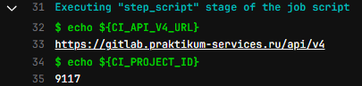

# Helm chart for momo-store
## Создание пайплайна для сборки и хранения чартов

На предыдущем этапе вы создалии необходимую инфраструктуру, надеюсь вы не забыли записать себе значения `ALB_EXT_IPV4_ADDR`, `ALB_GROUP_NAME`, `ALB_SEC_GROUP`, `ALB_SUBNETS` и `le_cert_id`, а так же не успели потерять супер важные файлы `~/.kube/config`. На этом этапе мы создадим пайплайн для создания чартов и развертывания на кластере (CD).

⚠️ Для выполнения некоторых действий нам потребуется утилита __kubectl__ и __helm__.

1. Создайте Nexus-репозиторий https://nexus.praktikum-services.tech/ тип: helm hosted, Deployment policy: allow redeploy., он потребуется для хранения чартов. Не стоит волноваться, супер секьюрные значения не будут подставляться в чарт на этапе публикации в репозиторий. 

2. Чтобы наш CD пайпалайн мог взаимодействоать с кластером необходимо создать статический файл конфигурации [ref](https://yandex.cloud/ru/docs/managed-kubernetes/operations/connect/create-static-conf):
```bash
kubectl create -f sa.yaml
# serviceaccount/admin-user created
# clusterrolebinding.rbac.authorization.k8s.io/admin-user created
# secret/admin-user-token created
```

Обратите внимание что в следующем блоке код выполняется в powershell, а так же подготовьте записанное значение `ALB_EXT_IPV4_ADDR`.
```powershell
# powershell
$SECRET = kubectl -n kube-system get secret -o json | ConvertFrom-Json | Select-Object -ExpandProperty items | Where-Object { $_.metadata.name -like "*admin-user*" }

$SA_TOKEN = [System.Text.Encoding]::UTF8.GetString([System.Convert]::FromBase64String($SECRET.data.token))

$CA_PATH = $(Resolve-Path ~/.kube/ca.pem).Path

kubectl config set-cluster sa-test2 --certificate-authority=$CA_PATH --embed-certs --server=https://<значение ALB_EXT_IPV4_ADDR>

kubectl config set-credentials admin-user --token=$SA_TOKEN

kubectl config set-context default --cluster=sa-test2 --user=admin-user

kubectl config use-context default

kubectl get namespace
```

3. Теперь необходимо самостоятельно установить External Secrets Operator:
```powershell
helm repo add external-secrets https://charts.external-secrets.io
# "external-secrets" has been added to your repositories

helm install external-secrets external-secrets/external-secrets --namespace external-secrets --create-namespace

kubectl create namespace ns

$ESO_CA_PATH = $(Resolve-Path ~/.kube/authorized-key.json).Path

kubectl --namespace ns create secret generic yc-auth --from-file=authorized-key=$ESO_CA_PATH

kubectl --namespace ns apply -f secret-store.yaml
```

3. После создания репозитория, нужно обязательно добавить в gitlab все следующие секреты:
|Ключ|Значение|Пояснение|
|--- |---     |---      |
|"NEXUS_HELM_REPO"|"https://nexus.praktikum-services.tech/repository/<your-nexus-repo-name>/"|за место <your-nexus-repo-name> подставьте имя nexus-репозитория |
|"NEXUS_HELM_REPO_USERNAME"||Ваш логин от nexus|
|"NEXUS_HELM_REPO_PASSWORD"||Ваш пароль от nexus|
|"KUBECONFIG_USER_TOKEN"||получите, используя `echo $SA_TOKEN`|
|"KUBECONFIG_CONTEXT_NAMESPACE"|"default"||
|"KUBECONFIG_CLUSTER_CONTROLPLANE_ADDRESS"|"https://<ALB_EXT_IPV4_ADDR>"| замените <ALB_EXT_IPV4_ADDR> на значение полученное при создании кластера |
|"KUBECONFIG_CLUSTER_CERTIFICATE_AUTHORITY_DATA"||получите, используя `cat $CA_PATH`|
|"DOCKER_REGISTRY_URL"|"gitlab.praktikum-services.ru:5050"|указание порта очень важно! |
|"DOCKER_REGISTRY_USERNAME"||Ваш логин от Gitlab |
|"DOCKER_REGISTRY_PASSWORD"||Ваш пароль от Gitlab|
|"BACKEND_REGISTRY_URL"||Пока пропускаем, добавим на следующем этапе |
|"FRONTEND_REGISTRY_URL"||Пока пропускаем, добавим на следующем этапе |
|"APP_INSTALL_ENVIRONMENT"|"momo-store"|Namespace для установки в кластере |
|"CM_CERT_ID"|<le_cert_id>|замените <le_cert_id> на значение полученное при создании кластера |

> [!warning]
> В качестве DOCKER_REGISTRY_USERNAME/DOCKER_REGISTRY_PASSWORD должны быть ваш логин и пароль от gitab'a (мы не будем использовать deploy токены и т.п.)
> В качестве BACKEND_REGISTRY_URL/FRONTEND_REGISTRY_URL должна быть строка вида: "gitlab.praktikum-services.ru:5050/std-ext-011-46/momo-store/frontend"
> Переменная APP_INSTALL_ENVIRONMENT указывает на имя неймспейса в котором установится чарт, может совпадать со значением KUBECONFIG_CONTEXT_NAMESPACE. Предпочтительнее указать разные значения, так как в чарте есть ресурсы, создаваемые с помощью хуков. Такие ресурсы не следуют за жизненным циклом основного чарта, в том числе не удаляются автоматически после его удаления.
> ALB_SUBNETS должен соответствовать CIDR подсетей кластера
> ALB_SEC_GROUP указываются группы безопасности, мы получали это значение на этапе развёртывания инфраструктуры
> ALB_EXT_IPV4_ADDR соответсвует публичному адресу ALB может должен соответсовать адресу A-записи доменной зоны, мы получали это значение на этапе развёртывания инфраструктуры
> ALB_GROUP_NAME логическое имя ALB, Ingress-контроллеры с совпадающим именем группы объединяются в один L7-балансировщик, мы получали это значение на этапе развёртывания инфраструктуры

4. Загрузите текущий локальный репозиторий в gitlab.praktikum-services.ru. Сборка чарта начнётся автоматически. ❗ Не забегайте вперёд, не запускайте вручную шаг deploy в UI Gitlab'a.

5. Перейдите в UI Gitlab'a и в запущенном пайплайне найдите задачу с именем "release_chart" (stage release)., найдите в самом начале её логов значения: 'CI_API_V4_URL' и 'CI_PROJECT_ID'., вот так они могут выглядеть:

Запишите где-нибудь значния этих переменных, они понадобятся на следующем этапе.

6. 🏁 На этом этапе мы закончили настройку пайпалайна с чартами, не забудьте записать значения переменных `CI_API_V4_URL` и `CI_PROJECT_ID`. Теперь следуйте инструкциям по созданию пайплайна сборки приложения в репозитории https://gitlab.praktikum-services.ru/std-ext-011-46/momo-store/-/tree/dev?ref_type=heads (ветка dev)


## Установка чарта в своём кластере:
> [!note]  
> Перед установкой чарта установите необходимые утилиты: __helm__, __kubectl__

1. Скачайте данный репозиторий: git clone  https://gitlab.praktikum-services.ru/std-ext-011-46/momo-store-chart.git

2. В кластере kubernetes необходимо самостоятельно создать ресурс ( тип Secret ) содержащий параметры подключения к вашему docker registry gitlab'a:
Измените в файле __dockerconfigjson.yaml__ строку 'base64 encoded docker secret' на валидный конфиг для подключения к docker-registry (https://clck.ru/3H6XKi) закодированный в формате base64: 
	1) декодируйте конфиг: 'ewoJImF1dGhzIjogewoJCSJnaXRsYWIucHJha3Rpa3VtLXNlcnZpY2VzLnJ1OjUwNTAiOnsKCQkJImF1dGgiOiAiUEd4dloybHVPbkJoYzNOM2IzSmtQZz09IgoJCX0KCX0KfQ==' 
	2) декодируйте строку: 'PGxvZ2luOnBhc3N3b3JkPg==' 
	3) замените её на ваши значения, закодируйте и подставьте обратно в конфиг 
	4) закодируйте конфиг и подставьте получившуюся строку за  место 'base64 encoded docker secret' 
	5) замените 'secret-name' на любое имя __и не забудьте__ его так же изменить в файле __values.yaml__: global.backend.docker_secret_name и global.frontend.docker_secret_name !
	6) создайте ресурс: `kubectl apply -f dockerconfigjson.yaml`

3. В файле __values.yaml__ измените параметры global.backend.version и global.frontend.version на значения версий из вашего репозитория с кодом.

4. Установите чарт и следуйте дальнейшим инструкциям: `helm install momo-store ./charts -n momo-namespace --atomic`
> [!tip] 
> Устанваливайте чарт в новый namespace. Сервисы для сбора метрик prometheus и grafana устанавливаются с помощью хуков, чтобы быть логически независимыми развёртываниями от основного чарта. При удалении чарта, эти ресурсы не удалятся вместе с основным чартом, их придётся удалять вручную!

После этих шагов фронтенд должен отвечать через браузер, grafana должна быть так же сразу доступна, никакой дополнительной конфигурации не требуется.


